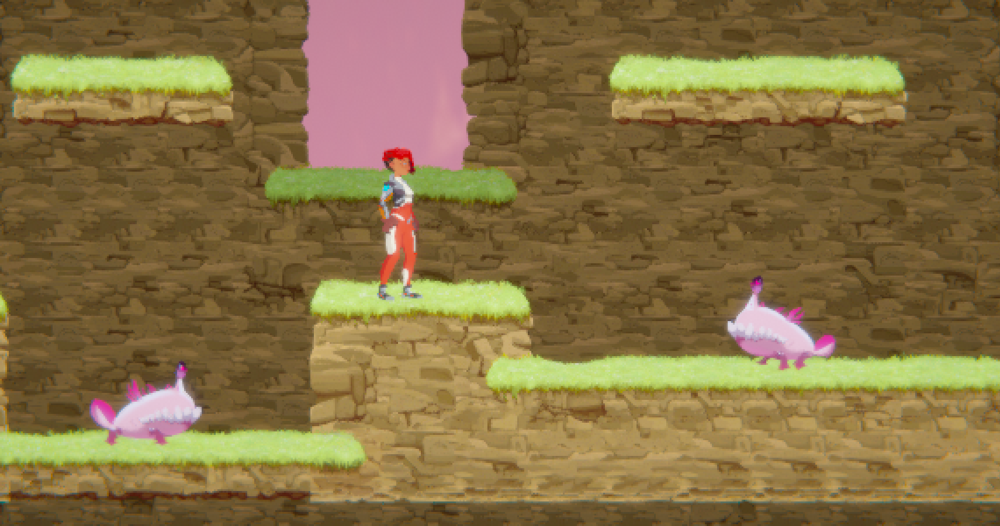
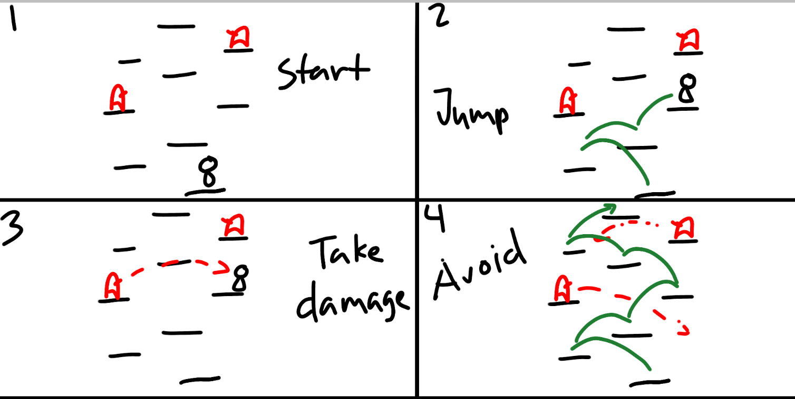
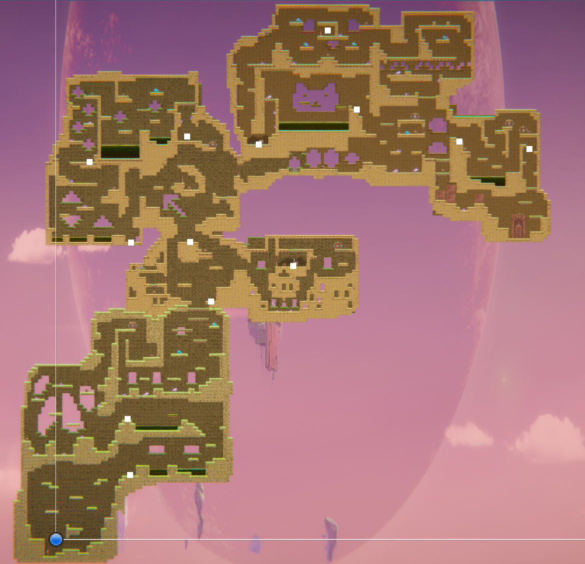

[](https://classroom.github.com/a/YyUO0xtt)
# COMP2150  - Level Design Document
### Name: Danica Juliane Ching
### Student number: 47458674

This document discusses and reflects on the design of your platformer level for the Level Design assessment. It should be 1500 words. Make sure you delete this and all other instructional text throughout the document before checking your word count prior to submission. Hint: You can check word count by copying this text into a Word or Google doc.

Your document must include images. To insert an image into your documentation, place it in the "DocImages" folder in this repo, then place the below text where you want the image to appear:

```

```

Example:


## 1. Player Experience 


### 1.1. Discovery
When I designed this game, I designed it as a series of rooms and strung them together to make my level map. The idea I went with is having the player learn through play. This was done by giving them simple encounters in the first level to prepare them for later encounters

The first level starts out slow, the player simply needs to jump their way out of the first room. The next encounter the player has is with the checkpoint and acid pits. Giving the player a safe environment to discover the features of the acid pit. This room also introduces a moving platform to slightly increase difficulty.


When the player meets the spikes, they are laid out in a way that restricts how the player lands on platforms. This teaches the player to look out for these spikes and avoid jumping on to them.


To enter the next room the player pushes down a push-able box. This teaches the player that they can access high platforms by locating a push-able box. After that they meet the possible enemies in this level, the chompers and the spitters, as they make their way out of the first level.





At this point, the players would have become familiar with what they would need to avoid as they progress through the level. They would also be familiar with the simple puzzles involving the push-able box.

### 1.2. Drama

The level is designed in a series of “rooms” in which the player’s “encounters” occur, so there are multiple connective spaces between rooms to help the player catch their breath between each section. I also tried to place many health boxes after areas that players may find difficult to help give them feelings of relief if they got low on health. There are also rooms that act as hubs between areas for the player when they progress to the next level. The second area has two connecting rooms while the third level has a room with enemies that you can clear out now that you have access to the weapons. 


 Most of the puzzle/encounter like room past the first level rewards the player with an item to help them progress in their journey. This gives the player feelings of joy when they are able to clear the room and get closer to their goal of completing the level.

### 1.3. Challenge

I was very concerned about the difficulty of the game. It was hard to try and experience the game as someone who didn’t already know where everything was located. Also trying to keep in mind the time constraints of the game, I lowered the difficulty as much as I could will trying to still give an experience of tension for the player. The light tension and swift progression through areas is intended to help player achieve flow.
I believe some of the bigger challenges of the game would be avoiding the spikes. I personally found them hard to see at times and they can cost you some progress if they knock you off platforms. I placed many health boxes all over the map and right after encounters with spikes to help patch players up after these encounters.


### 1.4. Exploration
I tried to incentivise the exploration of the player by guiding them through forks in the path with sneak peaks of the other room. For example, in level 2 the player is directed through a path that leads them to the melee weapon in another room, this incentivises them to pick up the melee weapon before continuing on their journey. Another example is in level 3, the player is able to see a room to their left hand-side while trying to reach the push-able box to proceed through the main room in level 3. 


I also tried to improve the exploration experience of branching paths by having them loop back to a main room so the player can avoid backtracking. For example, in level 3 you can chose to obtain the 3rd or 2nd key first. You are also able to obtain the 3rd key by entering the room from the back. Both rooms that hold the key eventually loop back to a main room that connects the areas together so there is not much backtracking and the player is able to seamlessly progress through the level.


## 2. Core Gameplay


### 2.1. Checkpoints & Acid
 The player first encounters acid in the second room of the first level. It is also stationed right after the player’s first checkpoint. This poses a deadly threat to the player and teaches the player that if they fall into an acid pit they will have to restart from the checkpoint.
 


### 2.2. Moving Platforms
After learning about the acid pits, the player is introduced to a moving platform that travels above the acid pit to deliver the player to safety.


### 2.3. Spikes
Spikes are introduced in the third room of the first level. These pose as threats that force the player to carefully position their jumps to avoid getting hurt. While spikes do not send the player back to the last checkpoint, the knock back is something the players must definitely avoid if they don’t want to get knocked off a platform.


### 2.4. Health Pickups
The first health pick up is available in the spike room. The player will naturally pass by it on the way out of the room. 


### 2.5. Push-able Box
When entering the final room of the first level the player will encounter a push-able box that they can use to make higher jumps.


### 2.6. Chompers
Chompers are an enemy that appears on the final room of the first level. They are a moving threat that will chase after the player if the player approaches them. The player can safely avoid them by jumping on the platforms. 


### 2.7. Spitters
Spitters are introduced in the same room that the chompers do. As the player attempts to exit the first level spitters spit acid at their heels. The player must quickly jump out of the room to avoid them.


### 2.8. Passthrough Platforms
 As the player makes their way out of the first level they encounter these special platforms. The passthrough platforms allow the player to jump through them, and duck under them.
 


### 2.9. Weapon Pickup (Staff) & Breakable wall
Upon making their way to the second level, the player is guided to the room where the staff is located. After traversing the room and solving a small puzzle, the player is able to obtain the staff and break out of the room.


### 2.10. Keys
Keys are necessary to open the door and complete the level. It is the goal of the player to locate them.


### 2.11. Weapon Pickup (Gun)
On the third level, the player is able to access a gun. Using the gun they are able to dispose of enemies from a distance.


## 3. Spatiotemporal Design
 
### 3.1. Molecule Diagram


### 3.2. Level Map – Section 1


### 3.3.	Level Map – Section 2


### 3.4.	Level Map – Section 3


## 4. Iterative Design 
When I designed my levels, I started by drawing out rooms of encounters I had wanted to happen. This resulted in a series of challenges and action-packed rooms. 


After testing the levels, I discovered that they were short and intense. I tried to stretch them out and lower the difficulty. Eventually I realised that by stretching out the encounters I had made the game very linear. 


I tried to change this by adding another path between the first and second levels of the game.


However, I was still unsatisfied by this. The optional path felt superficial and forced. And some of the sections were more challenging than I anticipated. Particularly the level with the moving platforms above a large acid pit.

Eventually I scrapped my initial design and began to redesign the layout of my levels.


After I drew a layout I was satisfied with, I filled up these rooms by recycling some of the ideas I liked from my original design but also adding some new puzzles.


After testing out the levels, I reduced the difficulty of some of the challenges from the first iteration and the levels felt less linear. Still there were some changes that could still be made. 

The first change was that it felt awkward backtrack from the door to get the second key. So, I added another path that allowed the player to climb out of the door room and into the hub. This circular path felt more natural in case the player decided to go in that direction and ended up at the door while missing a key. It also gives the player different options on how to approach the third key.

The second change was the room to the right of the second key felt a little boring. So, I changed this room’s layout and added a spitter to give it more of its own identity. 



After some edits made while playtesting the game, this is the finished level design I was able to come up with. There are many improvements that could still be made particularly in helping guide players to rooms located on their left-hand side. I had noticed while play-testing that players often move forwards heading to the right even if they can see something peeking on the left hand-side of the screen. With more testing I think this can be improved further.


